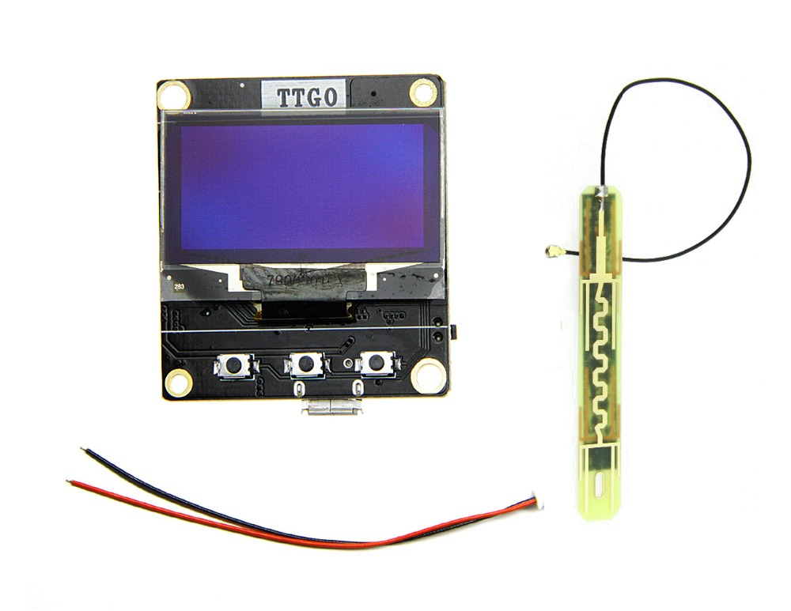

# ESP8266 Game oled 1.3"
## ```Nếu đã ghé vào thì cho mình 1 sao nhé```
## Phần cứng

- Thiết bị có 3 nút nhấn chức năng và 1 nút nhấn reset.
- pin được tích hợp bên trong sạc qua micro USB.
- có thể nạp lại chương trình khác nếu muốn.
- Nút nhấn D6，D8，D7
- Hỗ trợ ra hai hàng chân bên hông để lập trình `Không có D1 và D2`
- OLED（SDA-D1，SCL-D2）

- [Link mua thiết bị ở đây](https://shopee.vn/Esp8266-m%C3%A0n-h%C3%ACnh-oled-1.3--i.28473572.7534622099)
- [video demo deauther](https://youtu.be/wkQ8k0uaHms)
- [video demo game](https://www.youtube.com/watch?v=lw4Dw__N6mw)
- [](https://vimeo.com/3514904 "Little red riding hood - Click to Watch!")
- Ảnh Thiết bị
  
  
  

## Phần mềm thư viện

- Hỗ trợ Alert
- Hỗ trợ Menu
- Hỗ trợ Button


## Tham khảo

- [esp8266 deauther](https://github.com/SpacehuhnTech/esp8266_deauther)
- [SimpleButton](https://github.com/spacehuhn/SimpleButton)
- [esp8266-oled-ssd1306](https://github.com/ThingPulse/esp8266-oled-ssd1306)
